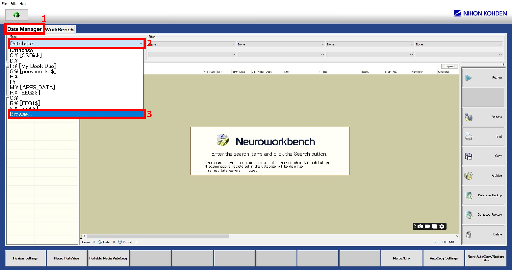
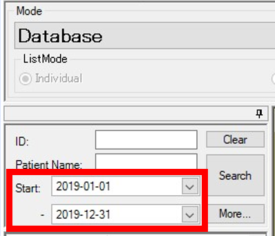
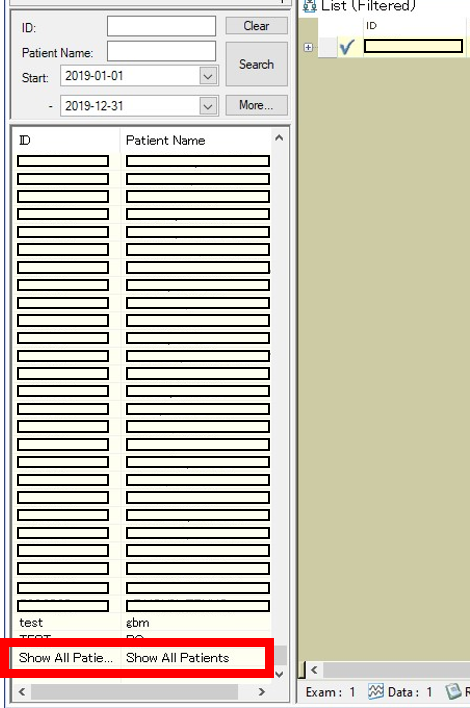
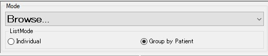
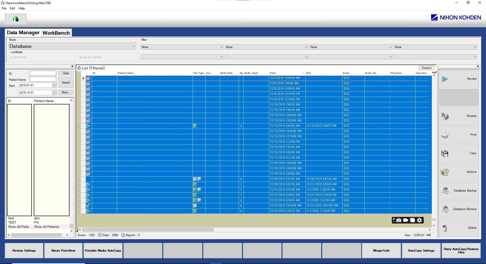
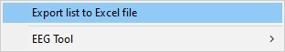

# nkpy

Library to read patient information from extracted Excel files from Nihon Kohden's NeuroWorkbench software.

Currently only extracts video information such as their path, start date and end date.

## Installation

You can install the package from GitHub directly:

With `uv` (recommended):
```sh
# if the project is not initialized already
uv init my-project
cd my-project

uv add git+https://github.com/CRCHUM-Epilepsy-Group/nkpy.git
```

With `pip`:
```sh
pip install git+https://github.com/CRCHUM-Epilepsy-Group/nkpy.git
```

## Documentation

[Documentation can be read here](https://crchum-epilepsy-group.github.io/nkpy/).


## Extracting Patient Information & Locating Video Data from Nihon Kohden NeuroWorkbench

This guide walks you through the steps to obtain an Excel file containing patient information and the paths where video data and other relevant information are stored.

### Step-by-Step Procedure

1. **Open Nihon Kohden Program**
   Launch the **Nihon Kohden** software.

2. **Navigate to Data Manager**
   - In the top menu, go to **Data Manager**.
   - Below the **Mode** menu, click on the **Database** dropdown menu and select **Browse...**<br>
   

3. **Select the Database**
   - Locate and select the appropriate database (e.g., **Data_Neuro#**).
   - Be patient, this step can take a while.

4. **Set Date Range**
   - In the left-side menu, select a **start date** and an **end date**.
   - **Important:** The recommended maximum range is **one year (12 months)**. Selecting a longer period may cause an error.<br>
   

5. **Display All Patients**
   - Once the patient list loads, scroll down to the bottom.
   - Click **Show All Patients** to ensure the full list is visible.<br>
   

6. **Organize the List**
   - In the top menu, below **ListMode**, select **Group by Patient**.
   - This arranges the list properly for easy selection.<br>
   

7. **Select All Patients**
   - Click on the first patient in the list.
   - Scroll to the last patient, hold **Shift**, and click the last entry to select them all.<br>
   

8. **Export to Excel**
   - Right-click the selection and choose **Export list to Excel File**.
   - Select a save destination and confirm the export.<br>
   

Once completed, your Excel file will contain all patient data, including references to where the corresponding video files and additional information are stored.
